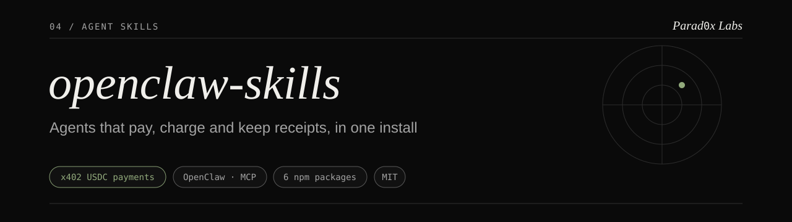
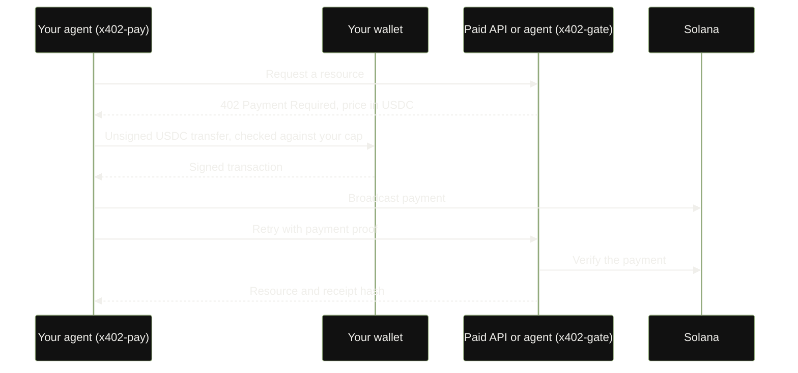

<p align="center"></p>

**openclaw-skills is a set of drop-in skills that let AI agents on OpenClaw, and any MCP client such as Claude Desktop, Cursor or Windsurf, pay for services, charge for their own work, and keep long sessions cheap.**

Agents increasingly call paid APIs and other agents, but they have no wallet-safe way to settle a bill. These skills add one: the agent pays in USDC on Solana through your own wallet, under a hard spending limit, and both sides keep a matching receipt. No platform holds the funds.

## At a glance

| **7 npm packages** | **Non-custodial** | **103.9x** |
|---|---|---|
| Pay, charge, metered billing, context compression, MCP tools, identity and one-call setup, published under `@parad0x_labs`. | Your wallet signs every payment. The skill never sees a key, and the USDC cap is enforced before a transaction is built. | Liquefy vault compression on agent-trace fixtures, against 63.8x for zstd -19, with every archive round-trip verified. |

[](https://github.com/Parad0x-Labs/openclaw-skills/actions/workflows/ci.yml)
[](https://www.npmjs.com/package/@parad0x_labs/openclaw-x402-pay)
[](https://www.npmjs.com/package/@parad0x_labs/mcp-server)

[](./LICENSE)

## How it works

One paid request, end to end. `x402-pay` runs in the buying agent, `x402-gate` in the selling one.



Both sides compute the same 32-byte receipt hash with no shared state, so each keeps a matching record. Each payment also carries a 0.05% protocol fee leg in the same atomic transaction. Full walkthrough: [The Web0 agent loop](./docs/WEB0_AGENT_LOOP.md).

## Quickstart

**Pay x402 endpoints from an OpenClaw agent.**

```bash
npm i @parad0x_labs/openclaw-x402-pay
```

```ts
import plugin, { setX402Signer } from "@parad0x_labs/openclaw-x402-pay";

// Wire your own wallet in at startup. The skill only ever hands you a serialized tx to sign.
setX402Signer({
  publicKey: myWallet.publicKey.toBase58(),
  signTransaction: async (txBase64) => myWallet.signSerialized(txBase64),
});
```

The agent now has a `pay_x402({ url })` tool. Payments run on devnet until you set `allowMainnet: true`; `maxAmountUsdc` caps each payment (default `1.0`). Config reference: [skills/x402-pay](./skills/x402-pay).

**Use the tools from Claude Desktop, Cursor or Windsurf.** Add to your MCP client config:

```json
{
  "mcpServers": {
    "parad0x": {
      "command": "npx",
      "args": ["-y", "@parad0x_labs/mcp-server"],
      "env": { "SOLANA_RPC_URL": "https://solana-rpc.publicnode.com" }
    }
  }
}
```

`SOLANA_RPC_URL` is used for read lookups. No tool submits a transaction while receipt anchoring is unavailable, so no keypair is needed. Details: [skills/mcp-server](./skills/mcp-server).

## The skills

| Skill | What it does | Install |
|---|---|---|
| [`x402-pay`](./skills/x402-pay) | Pays x402-gated APIs and agents in USDC. Bring your own signer, hard spend cap | `npm i @parad0x_labs/openclaw-x402-pay` |
| [`x402-gate`](./skills/x402-gate) | Charges other agents per call; funds land in your own wallet | `npm i @parad0x_labs/openclaw-x402-gate` |
| [`payment-session`](./plugins/payment-session) | Metered and subscription billing over `pay_x402`, with a per-session cap | `npm i @parad0x_labs/openclaw-payment-session` |
| [`context-capsule`](./skills/context-capsule) | Compresses long session history before the model call. No network, no chain | `npm i @parad0x_labs/openclaw-context-capsule` |
| [`mcp-server`](./skills/mcp-server) | MCP tools: x402 quote, receipt hashing, agent-identity lookup, `.null` resolution, stack status | `npx @parad0x_labs/mcp-server` |
| [`agent-passport`](./plugins/agent-passport) | Agent identity: `.null` name and ETH to Solana wallet binding, checked against the on-chain owner record | `npm i @parad0x_labs/openclaw-agent-passport` |
| [`web0-onboard`](./plugins/web0-onboard) | One call to derive an agent identity and return an x402 storefront config | `npm i @parad0x_labs/openclaw-web0-onboard` |

Companion: [`@parad0x_labs/null-mcp`](https://www.npmjs.com/package/@parad0x_labs/null-mcp) resolves `.null` names read-only from any MCP client. The full catalog, the module contract and the stack map are in [docs/SKILLS_CATALOG.md](./docs/SKILLS_CATALOG.md).

## Status

| Component | Status | Notes |
|---|---|---|
| x402 pay and gate (`x402-pay`, `x402-gate`, `payment-session`) | **Usable today** | USDC on Solana, public beta. Devnet by default, mainnet-beta opt-in |
| `context-capsule` | **Usable today** | Runs locally, no network |
| `mcp-server` | **Usable today** | Quote, receipt hashing, identity lookup, `.null` resolution, stack status |
| `agent-passport`, `web0-onboard` | **Usable today** | Identity lookup and storefront config. `.null` write builders are unavailable until the registrar relaunch |
| `.null` names (legacy mainnet registrar) | **Retired (mainnet 2026, records readable)** | Names registered June to August 2026 resolve read-only: owner, content pointer, x402 endpoint. Registration, updates and transfers are frozen |
| Receipt anchoring (`receipt_anchor`) | **Built · redeploy pending** | Unavailable until the redeploy under a fresh key. Receipt hashes are still computed and kept locally |
| Pay-by-name to a one-time stealth address | **Built · redeploy pending** | Implemented in code with tests; devnet redeploy under a fresh key pending |
| Dark NULL privacy settlement | **Devnet** | Canonical program on devnet; no mainnet deployment |
| Vault appliance (Liquefy) | **Usable today** | Python, runs locally. See below |

## The vault appliance

The second product in this repo is **Liquefy**, a Python flight recorder for agent runs, for teams that need an audit trail of what their agents did. It is independent of the skills above: they never import it, and three small skills (`liquefy-openclaw`, `liquefy_archive`, `liquefy_token_guard`) are its front-ends. It packs a run folder into compressed, optionally encrypted `.null` vaults, checks every archive by decompressing it and comparing hashes before accepting it, and keeps a SHA-256 hash-chained audit log. Vaults can be Ed25519-signed and their fingerprints anchored on Solana through an SPL Memo transaction, so a third party can confirm a vault existed without seeing its contents.

It ships 24 format-aware compression engines (JSON, logs, SQL, VPC flow, CloudTrail, screenshots and more) and a set of guards: policy enforcer with kill switch, context gate with replay blocking, safe run with automatic rollback, state and history guards, PII redaction and log de-noise.

```bash
git clone https://github.com/Parad0x-Labs/openclaw-skills
cd openclaw-skills
make setup
make quick DIR=~/openclaw/sessions
```

| Read next | Covers |
|---|---|
| [docs/VAULT_APPLIANCE.md](./docs/VAULT_APPLIANCE.md) | Install (macOS, Linux, Windows, pip, Docker), decoder CLI, OpenClaw integration, benchmarks and how to reproduce them |
| [docs/VAULT_TOOLS.md](./docs/VAULT_TOOLS.md) | One section per tool: guards, redaction, flight recorder, cloud sync, policy, context gate, safe run, anchoring |
| [docs/TRACE_VAULT.md](./docs/TRACE_VAULT.md) | Trace Vault format and workflow |
| [AGENTS.md](./AGENTS.md) | Presets, full commands and agent integration |

## For developers

| Path | Contents |
|---|---|
| `skills/` | TypeScript skills (`x402-pay`, `x402-gate`, `context-capsule`, `mcp-server`) and the three vault skill front-ends |
| `plugins/` | TypeScript plugins (`web0-onboard`, `agent-passport`, `payment-session`) and Python bridges for the vault |
| `api/`, `tools/` | Vault appliance: engines, orchestrator, CLI tools |
| `tests/` | Appliance tests, golden byte-perfect profiles, red-team harness |
| `schemas/`, `policies/` | JSON CLI contracts and policy presets |
| `docs/` | Guides linked throughout this README |

Every skill is a self-contained module: no imports across skills, its own version, README and `SKILL.md`, and its own path-filtered CI lane. Rules in [skills/README.md](./skills/README.md).

**Run the tests.** Each TypeScript package tests on its own:

```bash
cd skills/x402-pay && npm ci && npm test      # same pattern for each package under skills/ and plugins/
```

The appliance runs under pytest, plus the red-team release gate (mutation, crash-recovery and stress runs):

```bash
pip install -r requirements.txt pytest
pytest tests/
PYTHONPATH=tools:api bash tests/redteam/run_all.sh
```

GitHub Actions on `main`: [CI](./.github/workflows/ci.yml) for the appliance (Linux and macOS unit tests, CLI contracts, end-to-end smoke, red-team gate, benchmark regression), [Skills (TypeScript)](./.github/workflows/skills-ts.yml) per changed skill, and [Security](./.github/workflows/security.yml) (CodeQL, pip-audit).

More: [docs/WEB0_AGENT_LOOP.md](./docs/WEB0_AGENT_LOOP.md) · [docs/PARADOX_STACK.md](./docs/PARADOX_STACK.md) · [docs/SKILLS_CATALOG.md](./docs/SKILLS_CATALOG.md) · [PUBLISH_RUNBOOK.md](./PUBLISH_RUNBOOK.md) · [THREAT_MODEL.md](./THREAT_MODEL.md)

## Security

Money-touching skills are non-custodial: your wallet signs, the skills never hold or read a private key, and the paying side enforces a hard USDC cap before any transaction is built. The appliance fails closed: missing encryption keys stop the server, uploads are size-capped and path-sanitized, and no data is sent back to Parad0x Labs. Report vulnerabilities as described in [SECURITY.md](./SECURITY.md). MIT licensed, see [LICENSE](./LICENSE).

---

Parad0x Labs · [parad0xlabs.com](https://parad0xlabs.com)
